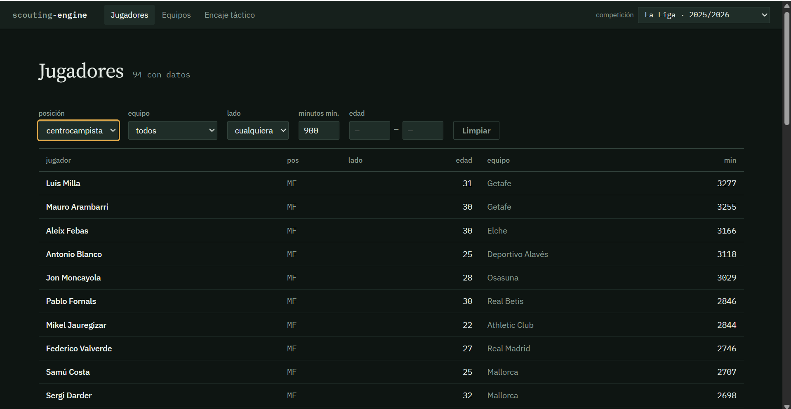
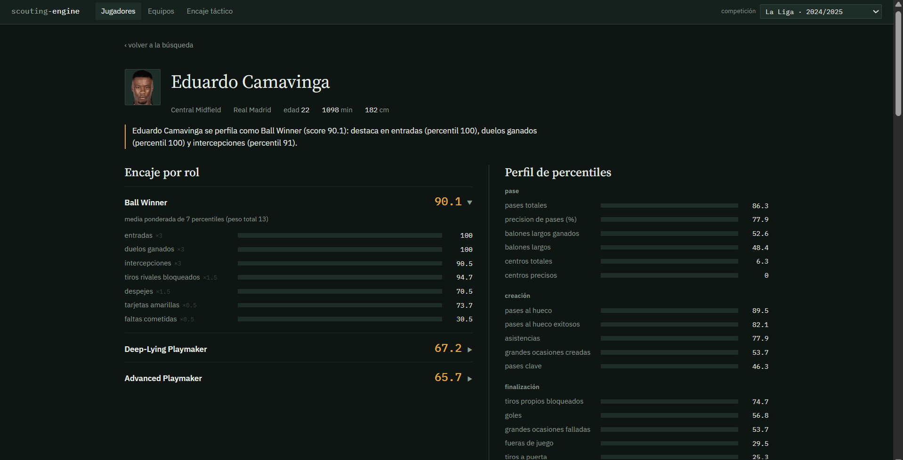
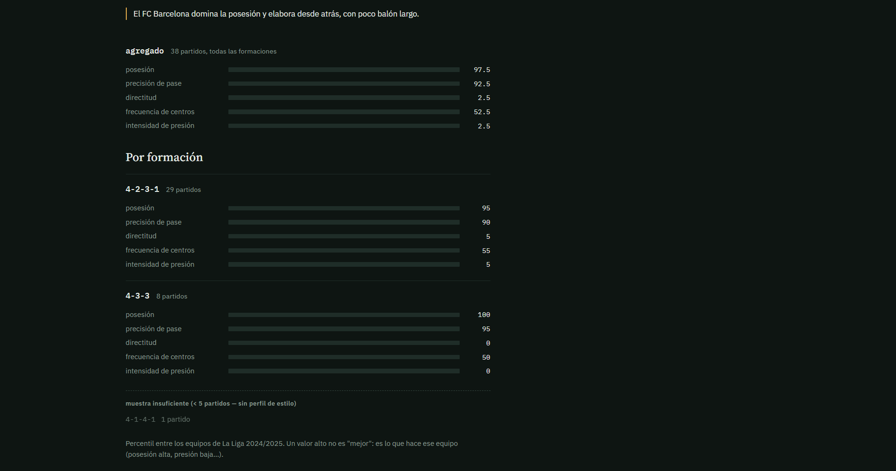
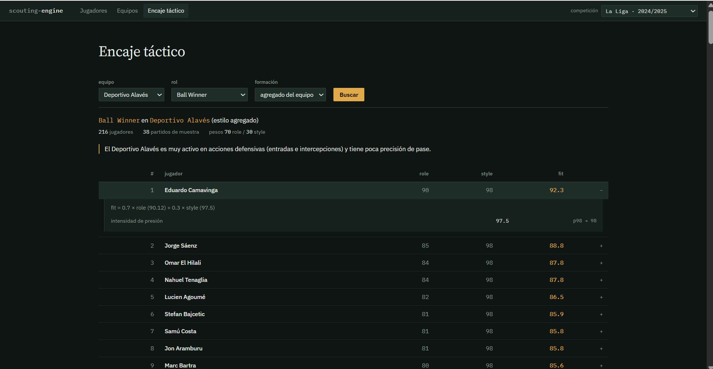
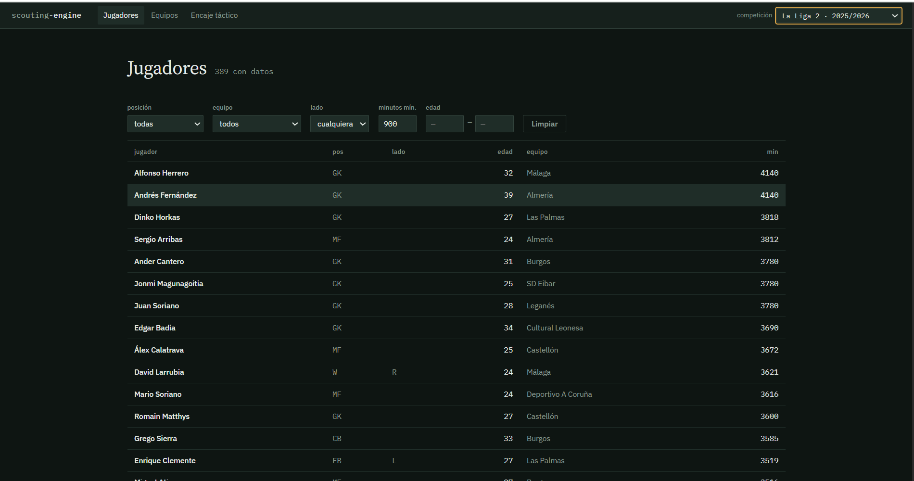
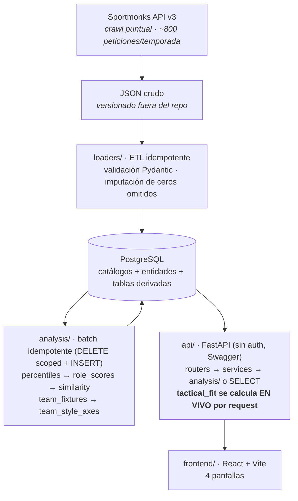

# scouting-engine

**Motor de scouting de fútbol basado en datos.** Dado un rol táctico y un
equipo, devuelve un ranking de jugadores que encajan — con el desglose
métrica a métrica de *por qué* encajan. Construido sobre estadísticas de
temporada de [Sportmonks](https://www.sportmonks.com/), PostgreSQL y una
capa analítica propia; sin *machine learning* opaco: cada número se puede
auditar hasta su origen.

Cobertura actual: **LaLiga (2024/25 y 2025/26), Segunda División,
Premier League, Serie A y Bundesliga (2025/26)** — 5 competiciones,
6 temporadas, ~3.800 jugadores / ~4.600 fichas jugador-temporada, cada
competición-temporada como su propio *pool* de percentiles.

> Proyecto personal. El código es mío; los datos son de Sportmonks y **no**
> se incluyen en el repositorio (ver [Datos y licencia](#datos-y-licencia)).

---

## El problema que resuelve

Un ojeador no busca "el mejor jugador" — busca "un central que sepa salir
con el balón para un equipo que tiene la pelota" o "un pivote destructor
para un equipo que presiona arriba". El talento en abstracto no basta: el
mismo jugador encaja distinto según el rol y el estilo del equipo.

`scouting-engine` modela exactamente eso con el **Player–Team Tactical Fit
Score**:

```
tactical_fit  =  0.70 · role_score  +  0.30 · style_compatibility
```

- **`role_score`** (0-100): cuánto se parece el perfil estadístico del
  jugador al arquetipo del rol, por percentiles dentro de su posición.
- **`style_compatibility`** (0-100): cuánto se parece el estilo de juego
  del equipo de origen del jugador al del equipo destino, en 5 ejes
  medidos a partir de datos reales de partido.

### Ejemplo real (con números del sistema)

**Eduardo Camavinga como *Ball Winner* (pivote destructor), LaLiga 2024/25:**

| Equipo destino | role_score | estilo del equipo | **Tactical Fit** |
|---|---|---|---|
| Deportivo Alavés | 90.1 | mucha actividad defensiva (presión p97) | **92.3** |
| FC Barcelona | 90.1 | domina el balón, apenas defiende (presión p2) | **63.8** |

El `role_score` es el mismo — Camavinga es el mismo jugador. Lo que mueve
30 puntos el encaje es el **estilo**: un destructor rinde donde hay balón
que recuperar, no donde tu equipo ya tiene la pelota. El sistema lo dice
con el desglose por eje, no como una caja negra.

---

## Capturas

| Búsqueda de jugadores | Ficha con desglose de rol |
|---|---|
|  |  |

| Perfil de estilo de equipo | Ranking de encaje táctico |
|---|---|
|  |  |



<sub>Diseño: "pizarra táctica de noche" — sin librería de gráficos, cada
valor es una barra horizontal 0-100 que se puede *leer*, no un radar que
hay que interpretar. El selector de arriba a la derecha cambia de
competición-temporada; cada una es un *pool* independiente. Ver
`frontend/README.md`.</sub>

---

## Arquitectura



Cada capa hace una cosa y deja el resultado en la base de datos para la
siguiente. La API **nunca reimplementa** lógica de `analysis/`: o llama al
módulo, o consulta la tabla que ese módulo ya pobló.

---

## Decisiones de diseño que mejor muestran el criterio

El registro completo —decisiones fechadas, investigaciones previas a cada
fase y análisis de licencias— está en [`docs/`](docs/README.md)
([`DECISIONS.md`](docs/DECISIONS.md),
[`roles_fase4_mapping.md`](docs/roles_fase4_mapping.md), las tres
investigaciones y [`TOS_ARCHIVE.md`](docs/TOS_ARCHIVE.md)). Cinco
decisiones que resumen el enfoque:

**1. Validar el dato real antes de diseñar nada.**
Una fase 0 entera (`../data-experiment/`, no versionada) descargó datos
reales de LaLiga y midió *qué devuelven de verdad* Sportmonks y
API-Football antes de escribir una línea de esquema. Reveló, entre otras
cosas, que `tiros_totales` diverge 30-50 % entre proveedores por
definición y que `precision_pases` de API-Football viene roto (`null` en
7/13 jugadores, y donde trae valor no es un porcentaje).

**2. Sportmonks como fuente única de estadística de jugador.**
Por calidad de dato (más rico, `%` de pase limpio, campos base coherentes)
y por licencia: Sportmonks **autoriza explícitamente** almacenar los datos
de la API en infraestructura propia; los términos de API-Football no lo
prohíben pero tampoco lo autorizan por escrito, y para un producto que
persiste datos esa ambigüedad es un riesgo. No se mezclan campos de dos
proveedores dentro de la misma estadística.

**3. Cuatro roles construibles, no siete.**
Se evaluaron 7 arquetipos contra la completitud real del dato por
posición. Cuatro se pueden construir con rigor (*Ball Winner*,
*Deep-Lying Playmaker*, *Advanced Playmaker*, *Ball Playing CB*). *Box-to-Box*
se queda fuera porque sin datos físicos (distancia, sprints) no se
distingue de un mediocentro completo posicional; *Pressing Forward* fuera
porque sin datos de evento por zona no hay forma de medir presión.
**Construir esos roles sería inventar señal que el dato no tiene.**

**4. Heurística explicable en vez de ML en el Tactical Fit.**
La matriz rol→estilo son signos declarados (`+possession`, `−directness`
para un Deep-Lying Playmaker…), no pesos aprendidos. Sin datos de evento
no hay forma de *aprender* qué perfil rinde en qué estilo sin
sobreajustar, y un modelo que no se puede explicar a un ojeador no sirve
en este dominio. El coste: la matriz es una hipótesis documentada, no un
resultado validado contra criterio experto.

**5. Los ceros que Sportmonks omite se imputan explícitamente.**
Sportmonks no devuelve una estadística cuando vale 0. Si no se imputa, el
cálculo de percentiles sobrestima a los jugadores flojos (un delantero sin
`tackles` parecería tener datos que faltan, no 0 entradas). Al cargar se
marca `is_imputed_zero = true`; los 6 campos base (minutos, apariciones,
pases, precisión, rating, duelos ganados) **nunca** se imputan: si faltan,
el jugador no jugó.

---

## Limitaciones documentadas

El proyecto trata sus límites como parte del rigor, no como algo a
esconder:

| Límite | Consecuencia | Por qué |
|---|---|---|
| **Sin xG / xA** | La calidad de finalización y de creación se aproxima con *grandes ocasiones creadas / falladas*, no se mide. | Sportmonks no lo da a nivel agregado de temporada. |
| **Sin datos de evento / presión por zona** | *Pressing Forward* no es construible. `press_intensity` mide "actividad defensiva" (tackles + intercepciones), que correlaciona con **menos** posesión — no es presión real (PPDA). | Requiere datos de tracking o de evento. |
| **Sin League Strength Coefficient** | Por defecto los rankings **no mezclan competiciones**: un percentil de Segunda (o de la Bundesliga) no es comparable a uno de LaLiga y no hay factor de ajuste. El buscador de encaje táctico tiene un **toggle cross-liga** que sí las mezcla (cada fit con el pool del jugador), con un aviso visible de que no hay ajuste de nivel. | Construir el coeficiente es trabajo futuro consciente. |
| **Sin pie dominante ni valor de mercado** | Ningún filtro puede apoyarse en ellos. | `preferred_foot` viene NULL en todo el roster; el valor de mercado no está en ninguna fuente. |
| **Volumen defensivo sesgado por posesión** | Los centrales de equipos dominadores (Rüdiger) salen bajos en métricas defensivas per-90 porque su equipo tiene el balón. | Un ajuste por posesión es mejora futura. |
| **Sin entrenador por temporada** | La narrativa de equipo usa solo el nombre del club. | Las fechas de tenencia de Sportmonks son incoherentes en los límites (varios entrenadores con `end` *antes* de empezar la temporada) — [`docs/fase11_coach_investigation.md`](docs/fase11_coach_investigation.md). Descartado para temporadas pasadas; reconsiderable para la temporada en curso. |

---

## Stack y puesta en marcha

**Backend:** Python 3.10+ · SQLAlchemy 2.0 · Pydantic 2 · PostgreSQL 14+ ·
FastAPI + Uvicorn.
**Frontend:** React 19 · Vite · react-router · Vitest (sin librería de
gráficos, sin estado global).
**Sin Alembic** todavía: el esquema se crea con `create_all()` + un
catálogo estático sembrado; los cambios de esquema van en scripts de
migración manual (`db/migrate_*.py`).

```bash
# 1. Base de datos + esquema
createdb scouting
cp .env.example .env            # editar DATABASE_URL con tus credenciales
pip install -r requirements.txt
python -m db.create_schema      # crea tablas + catálogos estáticos

# 2. Cargar datos  (necesita un token de Sportmonks; el descargador vive
#    en ../data-experiment/, ver nota abajo)
python -m loaders.etl_laliga              # roster + estadísticas de temporada
python -m loaders.etl_team_fixtures --offline   # partidos (si hay JSON cacheado)

# 3. Capa analítica (idempotente, se puede relanzar)
python -m analysis.percentiles           # per-90 + percentiles por posición
python -m analysis.role_scores           # Player Role Score 0-100 + desglose
python -m analysis.similarity            # top-20 similar por jugador (cosine)
python -m analysis.team_style            # ejes de estilo de equipo

# 4. API + frontend
python -m uvicorn api.main:app --reload   # http://127.0.0.1:8000/docs
cd frontend && npm install && npm run dev # http://localhost:5173
```

> **Nota sobre los datos.** El JSON crudo de Sportmonks y los scripts de
> descarga (`scripts/NN_*.py`) viven en un directorio hermano
> `../data-experiment/` que **no forma parte de este repositorio** (contiene
> datos bajo licencia de terceros). Sin él, este repo se lee como muestra
> de **código y metodología**: el esquema, la capa analítica, la API y el
> frontend son completos y ejecutables una vez hay una base de datos
> poblada. Con un token de Sportmonks se puede reconstruir la descarga.

Cada módulo de `analysis/` y de `loaders/` acepta `--dry-run` y
`--season-id` / `--season-dir` para trabajar sobre una sola
competición-temporada sin tocar el resto.

---

## Cómo funciona cada capa

<details>
<summary><b>ETL — <code>loaders/</code></b></summary>

Reutiliza el JSON ya descargado (no vuelve a pedir a la API salvo
`--fetch-missing`). Pipeline por jugador:

```
player_stats/{id}.json
  → validación Pydantic         [si falla: log + skip, no tumba el ETL]
  → upsert players              (ON CONFLICT sportmonks_player_id)
  → upsert player_team_season   (ON CONFLICT player_id + season_id + order_in_season)
  → upsert player_statistics    (imputa is_imputed_zero donde Sportmonks omitió el 0)
```

**Idempotente:** cada jugador se procesa "borrar sus etapas (cascade a sus
stats) + reinsertar", con commits por lotes. Si se corta a la mitad, se
relanza sin limpiar nada. Un jugador puede tener **varias etapas** en una
temporada (cesión / traspaso); las stats vienen separadas por equipo y se
agregan con `SUM ... GROUP BY`.

</details>

<details>
<summary><b>Percentiles — <code>analysis/percentiles.py</code></b></summary>

`PERCENT_RANK` dentro de `(season, competition, position_bucket, stat_type)`,
sobre los jugadores con **≥ 900 minutos** (umbral = parámetro, no
constante). Orientado con `stat_types.direction` → **percentil 100 = mejor
de su posición, siempre** (para `lower_better` como pérdidas o tarjetas se
invierte). Los contadores se normalizan a per-90; los `%` y el rating se
promedian ponderando por minutos.

</details>

<details>
<summary><b>Player Role Score — <code>analysis/role_scores.py</code></b></summary>

```
score = SUM(percentil × peso) / SUM(peso)          → ya en [0, 100]
```

Pesos por nivel (núcleo 3 / apoyo 1.5 / contexto 0.5). **Métricas que
faltan se excluyen del numerador y del denominador** (el peso se
renormaliza), no se imputan a percentil 50 — un percentil ausente es falta
de dato, no rendimiento medio. Guarda: si el peso disponible cae por debajo
del 60 % del peso del rol, no se emite fila. `player_role_score_breakdown`
guarda una fila por métrica (`percentile`, `weight`, `contribution`); su
suma reproduce el score — esa es la explicabilidad.

</details>

<details>
<summary><b>Player Similarity — <code>analysis/similarity.py</code></b></summary>

Cosine similarity sobre el vector de percentiles per-90 (todas las métricas
del *bucket*), solo dentro de la misma posición y temporada. Se guarda solo
el **top-20** por jugador, no la matriz N². Los filtros de edad y lado son
parámetros de *consulta* (se aplican con un `WHERE` al leer), no del
cálculo: la similitud estadística entre dos jugadores no cambia según el
filtro posterior.

</details>

<details>
<summary><b>Team Style Profile — <code>loaders/etl_team_fixtures.py</code> + <code>analysis/team_style.py</code></b></summary>

Perfil de equipo desde **datos reales de partido**, no a mano. Grano crudo:
1 fila por (equipo, partido); la agregación por formación se hace por
consulta. `goals` **nunca** sale del bloque de estadísticas (Sportmonks lo
omite en 0) — siempre de `scores[]`. 5 ejes de estilo (`possession`,
`pass_accuracy`, `crossing_frequency`, `press_intensity`, `directness`),
cada uno como percentil del equipo entre los de su competición-temporada.
Umbral: ≥ 5 partidos por formación para emitir perfil de formación.

</details>

<details>
<summary><b>Tactical Fit — <code>analysis/tactical_fit.py</code></b></summary>

**No se materializa.** El producto jugador×equipo×rol×formación (~34 k
filas de aritmética trivial) quedaría obsoleto al tocar el peso 70/30. Se
calcula **bajo demanda** con una función parametrizada. Lo que sí se
precalcula (parte cara y reutilizable): los percentiles de estilo en
`team_style_axes`. `style_compatibility = SUM(pctl_efectivo · peso) /
SUM(peso)`, donde `pctl_efectivo = 100 − percentil` para los ejes marcados
`negative` (la directitud alta perjudica a un Deep-Lying Playmaker).

</details>

<details>
<summary><b>API — <code>api/</code></b></summary>

FastAPI, sin auth, Swagger en `/docs`. `routers/` (validan y delegan) →
`services/` (queries + llamada a `analysis/`) → `schemas/` (Pydantic
req/resp). Multi-competición: `?season=` (id interno, `sportmonks_season_id`
o nombre) y `?competition=` para desambiguar cuando el nombre de temporada
se repite entre ligas.

| Método | Ruta | Qué hace |
|---|---|---|
| `GET` | `/seasons` | Competición-temporadas cargadas (para el selector). |
| `GET` | `/players` | Lista paginada con filtros (bucket, equipo, edad, lado, minutos). |
| `GET` | `/players/{id}` | Bio + foto + percentiles + `summary` narrativo (por reglas). |
| `GET` | `/players/{id}/similar` | Top-20 similar, con filtros de edad/lado sobre el resultado. |
| `GET` | `/players/{id}/roles` | Role scores + desglose completo por métrica. |
| `GET` | `/players/{id}/best-teams` | Tactical Fit invertido: mejores equipos para el jugador. `?cross_competition=true` rankea equipos de las 5 ligas (con aviso). |
| `GET` | `/teams` · `/teams/{id}/style` | Equipos y perfil de estilo por formación + narrativa. |
| `GET` | `/roles` | Los 4 roles con su matriz de pesos y de estilo. |
| `POST` | `/scouting/tactical-fit` | Ranking de jugadores por encaje en un equipo + rol. Body `cross_competition:true` incluye jugadores de las 5 ligas (con aviso). |

Un jugador por debajo del umbral de minutos devuelve **200 con listas
vacías** (existe, pero sin percentiles fiables), nunca 404. Los errores
422 explican la alternativa (formación sin muestra → lista las que sí
tienen perfil).

</details>

<details>
<summary><b>Resúmenes narrativos — <code>analysis/narrative.py</code></b></summary>

Frases por **plantilla fija, deterministas y auditables — sin LLM**.
`player_role_summary` ("*se perfila como Ball Winner (score 90.1): destaca
en entradas (percentil 100)…*") y `team_style_narrative` (los 1-2 ejes más
alejados del percentil 50, umbrales ≥70 / ≤30; admite explícitamente el
caso "sin rasgo marcado").

</details>

---

## Esquema de datos

**Catálogos:** `competitions`, `seasons` (cada una de *una* competición vía
`competition_id`), `teams` (sin competición: la división depende de la
temporada), `positions`, `stat_types`, `roles` + `role_buckets` +
`role_weights`, `team_stat_types`, `role_style_weights`.
**Entidades:** `players`, `player_team_season` (multi-etapa),
`player_statistics`, `team_fixtures`, `team_fixture_statistics`.
**Derivadas** (idempotentes, DELETE scoped + INSERT): `player_percentiles`,
`player_role_scores` + `player_role_score_breakdown`, `player_similarity`,
`team_style_axes`.

---

## Estado y roadmap

**Construido (Fases 0-12):** validación de dato → esquema → ETL →
percentiles → taxonomía de roles → Player Role Score → Similarity → Team
Style Profile → Tactical Fit → API → frontend → resúmenes narrativos →
multi-temporada → multi-competición.

**Extensión futura consciente** (no olvidos — decisiones de "todavía no"):

- **League Strength Coefficient** — para poder comparar jugadores de
  distintas competiciones (Segunda vs Primera, Bundesliga vs LaLiga) en un
  mismo ranking.
- **Entrenador de la temporada en curso** — donde el flag `active` de
  Sportmonks sí es fiable.
- **Más ligas y temporadas** — el pipeline es multi-competición; añadir
  una liga es descargar su temporada y recalcular scoped.
- **Potencial / desarrollo de jóvenes** — mencionado en el roadmap
  original, sin construir.
- **Ajuste por posesión** de las métricas de volumen defensivo.
- **Alembic** para las migraciones de esquema.

---

## Estructura del repositorio

```
db/          esquema SQLAlchemy, creación y migraciones
loaders/     ETL: Sportmonks JSON → PostgreSQL (idempotente)
analysis/    capa analítica batch + Tactical Fit bajo demanda
api/         FastAPI sobre las tablas ya pobladas
frontend/    React + Vite, 4 pantallas
docs/        decisiones, investigaciones previas y notas de sesión (ver docs/README.md)
```

---

## Datos y licencia

- **Código:** [MIT](LICENSE).
- **Datos:** provienen de la API de Sportmonks bajo su licencia, que
  autoriza almacenar y construir productos derivados pero **no** revender
  los datos ni reproducir el servicio. Este repositorio **no contiene
  ningún dato de Sportmonks** — el JSON crudo y la base de datos están en
  `.gitignore`. Análisis de términos en
  [`docs/TOS_ARCHIVE.md`](docs/TOS_ARCHIVE.md) y
  [`docs/DECISIONS.md`](docs/DECISIONS.md).
